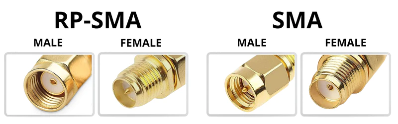

# Why Does RPSMA Exist?

SMA connectors, first introduced in the 1960s, are widely used in radio and communication equipment. They follow standard gender conventions, where the female connector features a center hole, and the male connector has a center pin.

A variant of the SMA connector, known as the Reverse Polarity SMA (RP-SMA), was developed primarily to adhere to regulations imposed by the Federal Communications Commission (FCC). Visually, RP-SMA connectors are nearly identical to SMA connectors. However, their pins and holes are reversed. This means that an RP-SMA male connector has a center hole, while an RP-SMA female connector has a center pin.

The FCC regulation 47 CFR 15.203 mandates that devices known as "intentional radiators" must be designed to ensure that no antenna other than the one provided by the manufacturer is used with the device. To comply with this regulation, WiFi equipment manufacturers developed RP-SMA connectors. This unique design allows manufacturers to ensure that their devices will only work with the antennas they provide, thus meeting the FCC's requirements.

It's also worth noting that the use of these connectors varies depending on the equipment. RP-SMA connectors tend to be used on WiFi antennas, while SMA connectors are more common on 3G/4G/5G devices.

## References

1. [https://www.law.cornell.edu/cfr/text/47/15.203](https://www.law.cornell.edu/cfr/text/47/15.203)
2. [https://blog.linitx.com/what-are-sma-rp-sma-connectors-and-whats-the-difference/](https://blog.linitx.com/what-are-sma-rp-sma-connectors-and-whats-the-difference/)
3. [https://store.rokland.com/blogs/news/connectors-101-rp-sma-vs-sma](https://store.rokland.com/blogs/news/connectors-101-rp-sma-vs-sma)
